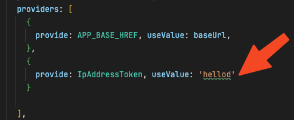
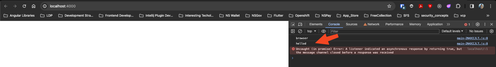

# Angular 17 SSR - Weird Issue

Related to https://github.com/angular/angular-cli/issues/26323

Example of TransferState from Server (server.ts) to Client (Angular Component)

> Had to set preRender is set to `false` in angular.json 

1. ng build
2. npm run serve:ssr:angular-ssr

value set on server in the provider:

is transferred to client.

However, when you set preRender to `true`. The server stops transferring value to client.
